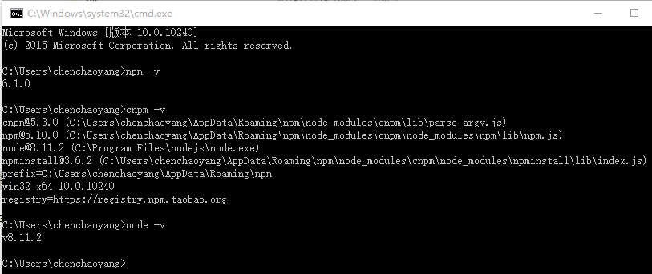
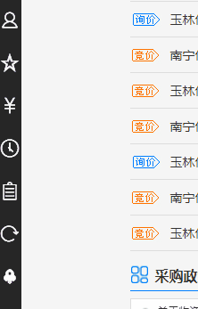
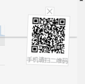

# 项目说明文档
恭喜：本项目在公司前端大赛中荣获一等奖。
[PC端访问地址（能否访问取决于云服务器是否在租用起内）](http://112.74.36.152/homework/build/index.html)
  
手机端访问请扫描下面二维码（能否访问取决于云服务器是否在租用起内）  

## 一 运行说明
1. 将项目使用git clone到本地
2. 本地安装node环境，我本地环境如下图：
    
3. 执行 npm install 安装项目所需要的依赖
4. 执行 npm run server 进行实时热加载开发
5. 打包执行 npm start
6. 启动成功后，本地访问地址：http://localhost:8099/

## 二 目录结构说明

## 三 项目技术栈
1. 采用**webpack**构建
2. 使用**react**框架
3. 使用**less**的css预编译技术
4. 使用**es6**进行代码编写
5. 阿里的**iconfnt**图标库

## 四 组件结构
1. 整个页面分为三个部分：顶部、中部、底部。
2. 顶部分为：登录，搜索，导航
3. 中部分为：广告横幅、名企采购展示、名企推荐爆品、最新采购情况、采购政策、行业资讯、答疑解惑
4. 底部分为：友情链接，公司名称和链接的

## 五 在效果图基础上新增组件
### 1. 固定位置的搜索框，如下图：

### 2. 固定位置的回到顶部的火箭图标，如下图：

### 3. 大幅图片轮播功能组件，如下图：

### 4. 登录区域的二级菜单，如下图：

### 5. 左侧固定快捷入口

### 6. 旋转动态的二维码

[项目显示地址（内外网均可访问）](http://112.74.36.152/homework/build/index.html)

## 六 作者联系方式
项目物资系统产品部 陈超阳
1. 微信：635383679
2. QQ：635383679
3. 邮箱：chenchaoyang2013@163.com
